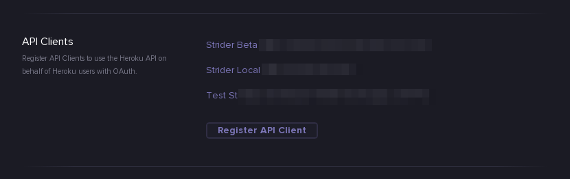

# Heroku Deploys with Strider

Prerequisites:

- [heroku cli](https://devcenter.heroku.com/articles/heroku-cli)

# Important config!

To use on **anything other than localhost:3000**, you need to register your own **Heroku API client**, at https://dashboard.heroku.com/account. See [this docs page](https://devcenter.heroku.com/articles/oauth) for more info.

This is a screenshot of what you will see on your dashboard:



# Configuring Strider to use your Heroku API Client

If running locally we recommend using ngrok: `ngrok http 3000` and using the provided url as your host in Heroku and for `SERVER_NAME` env on Strider.

Add an API client for the url pattern: `https://yourhostnameofstrider/ext/heroku/oauth/callback`
Copy values for `HEROKU_OAUTH_ID` and `HEROKU_OAUTH_SECRET`, you'll configure Strider to use them later.

Install the [heroku cli](https://devcenter.heroku.com/articles/heroku-cli), and login:

```sh
heroku login
```

## Running Strider locally:

```sh
SERVER_NAME=<servername via ngrok> PLUGIN_HEROKU_CLIENT_ID=<id> PLUGIN_HEROKU_CLIENT_SECRET=<secret> npm start
```

## Running Strider on Heroku:

Install the [heroku cli](https://devcenter.heroku.com/articles/heroku-cli), and run:

```sh
heroku config:add PLUGIN_HEROKU_CLIENT_ID=<id> PLUGIN_HEROKU_CLIENT_SECRET=<secret> --app <appname>
```
